# [调试JS](https://www.cnblogs.com/wyt007/p/10084529.html)

**Chrome** 是 **Google** 出品的一款非常优秀的浏览器，其内置了开发者工具（**Windows** 系统中按下 **F12** 即可开启），可以让我们方便地对 **JavaScript** 代码进行调试。

为方便大家学习和使用，本文我对 **Chrome** 的调试技巧做个系统的总结。

## 一、设置断点

有两种方法可以给代码添加断点：

### 方法1：在 Source 内容区设置

（1）找到要调试的文件，然后在内容源代码左侧的代码标记行处点击，即可打上一个断点。

（2）刷新浏览器，当页面代码运行到断点处便会暂停执行。

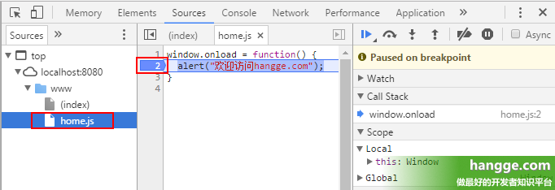

 

 

### 方法2：在 js 文件中设置

（1）我们在 **js** 源文件中需要执行断点操作的代码前加上 **debugger**。

（2）刷新浏览器，当页面代码运行到断点处会暂停执行。

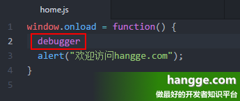

 

## 二、设置断点执行条件

（1）右键点击设置的断点，选择 **Edit breakpoint...**

（2）输入执行断点的条件表达式，当表达式为 **true** 时断点调试才会生效。有了条件断点，我们在调试代码的时候能够更加精确地控制代码断点的时机。

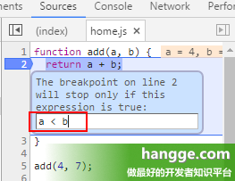

 

## 三、Call Stack 调用栈

### 1，界面介绍

（1）当断点执行到某一程序块处停下来后，右侧调试区的 **Call Stack** 会显示当前断点所处的方法调用栈，从上到下由最新调用处依次往下排列。

（2）**Call Stack** 列表的下方是 **Scope Variables** 列表，可以查看此时局部变量和全局变量的值。

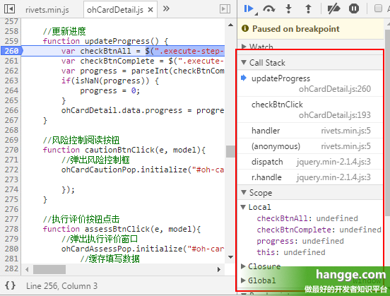

### 2，使用技巧

（1）调试时当前调用在哪里，**Call Stack** 列表里的箭头便会指向哪里。同时当我们点击调用栈列表上的任意一处，便会调到相应的位置，方便我们再回头去看看代码。

（2）如果想重新从某个调用方法处执行，可以右键选择 **Restart Frame**。断点就会跳到此处开头重新执行，同时 **Scope** 中的变量值也会依据代码重新更改，这样就可以方便地回退来重新调试，省得我们再重新刷新整个页面。

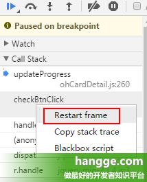

## 四、DOM 元素设置断点

### 1，DOM Breakpoints 介绍

除了可以给 **js** 代码设置断点，我们还可以给 **DOM** 元素设置断点。因为我们有时候需要监听和查看某个元素的变化、赋值情况，但是并是不太关心哪一段代码对它做的修改，只想看看它的变化情况，那么可以给它来个监听事件。

### 2，使用说明

（1）我们右键点击需要监听的 **DOM** 节点，选择“**Break On...**”菜单项，在出现的三个选择项中任选一个便会添加断点。

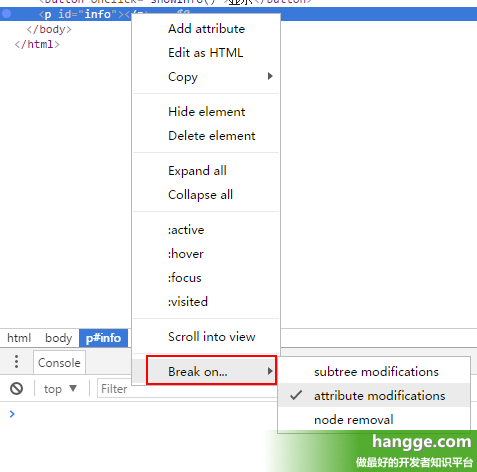

 

 

 

（2）这三个选择项分别对应如下三种修改情况：

- **suntree modifications**：子节点修改
- **attribute modifications**：自身属性修改
- **node removal**：自身节点被删除。

（3）设置好断点后，当 **DOM** 元素要被修改时，代码就会在自动停留在修改处。

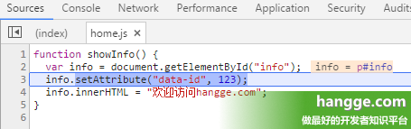

 

## 五、统一管理所有断点

我们可能会在不同的文件、不同的位置添加许多断点。这些都会显示在 **Source** 页面里的 **Breakpoints**、**DOM Breakpoints** 区域中：

- **Breakpoints**：**js** 断点
- **DOM Breakpoints**：**DOM** 元素断点

点击断点前面的复选框可以暂时“去掉/加上”该断点，点击断点可跳转到相应的程序代码处。

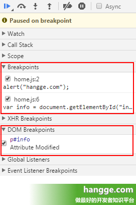

 

 

## 六、快捷键

### 1，快速定位文件

使用快捷键：**ctrl + p**

***\*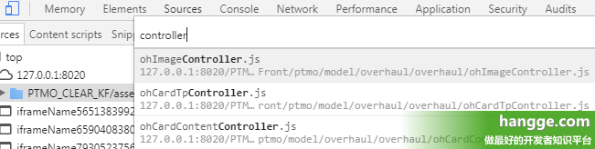\****

### 2，快速定位文件中成员函数

使用快捷键：**ctrl + shif + o**

***\*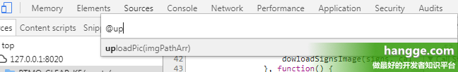\****

 

 

## 七、格式化

### 1，js代码格式化

为了减小体积，有时候我们发现一些 **js** 源码都是压缩之后的代码，我们可以点击下面的 **{}** 大括号按钮将代码转成可读格式。

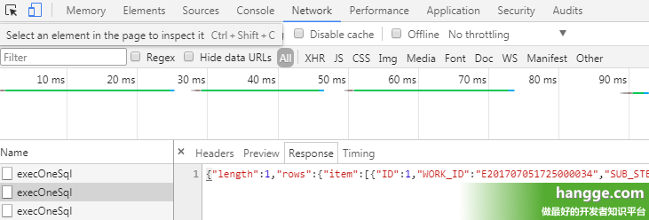

 

### 2，格式化返回的 JSON 数据

（1）有时我们调试程序时需要查看服务端返回的数据内容，这个在 **Network** 选项卡中就可看到。但如果后台返回的是没有格式化的 **JSON** 数据，查看起来会异常痛苦。


 

 

 

 

（2）我们可以通过 **chrome** 控制台的 **copy** 接口来实现 **JSON** 数据的格式化。

（3）首先请求项的右键菜单中选择 **Copy Response** 拷贝响应内容。

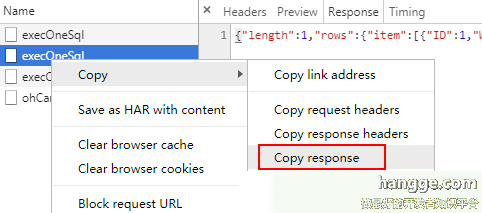

 

 

 

（4）命令行中先输入 **copy()**，然后将拷贝的数据粘贴到括号中。

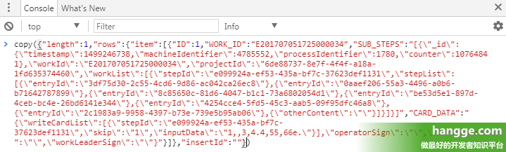

 

 

 

（5）回车后 **copy** 接口便会自动将数据进行格式化，并保存到剪贴板中。我们将其粘贴到文本编辑器中就可以看到效果：

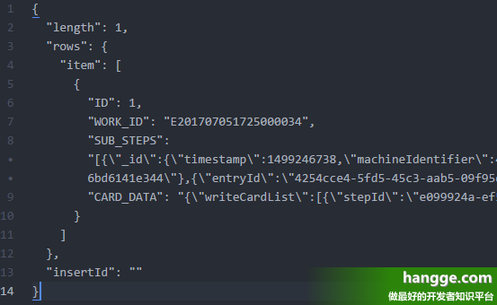

 

## 八、使用 Snippets 编写代码片段

### 1，Snippets 介绍

（1）在 **Souces** 页面下的 **Snippets** 栏目中，我们可以随时进行 **JS** 代码的编写，运行结果会打印到控制台。

（2）代码是全局保存的，我们在任何页面，包括新建标签页，都可以查看或运行这些代码。我们不再需要为了运行一小段 **JS** 代码而新建一个 **HTML** 页面。

（3）**Snippets** 的方便之处在于，我们只需要打开 **Chrome** 就可以编写一份任意页面都可以运行的JS代码。

### 2，使用样例

（1）点击“**New Snippet**”按钮，创建一个新的片段文件。

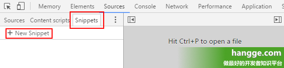

 

 

（2）在代码区域输入 **js** 代码

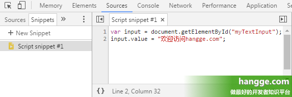

 

 

（3）按下“**Ctrl + Enter**”或者点击右下方的按钮执行代码，可以看到代码执行成功且反应到当前页面上了。

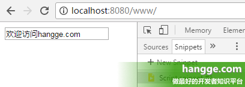

 

 

## 九、Async 调试

**Chrome** 调试器的 **Async** 模式是为调试异步函数所设计一个功能。

### 1，测试代码

下面是一段使用 **Promise** 的代码：

[](javascript:void(0);)

```
//做饭
function cook(){
    console.log('开始做饭。');
    var p = new Promise(function(resolve, reject){  //做一些异步操作
        setTimeout(function(){
            console.log('做饭完毕！');
            resolve('鸡蛋炒饭');
        }, 1000);
    });
    return p;
}
 
//吃饭
function eat(data){
    console.log('开始吃饭：' + data);
    var p = new Promise(function(resolve, reject){ //做一些异步操作
        setTimeout(function(){
            console.log('吃饭完毕!');
            resolve('用过的碗和筷子');
        }, 2000);
    });
    return p;
}
 
cook()
.then(eat)
.then(function(data){
    console.log(data);
});
```

[](javascript:void(0);)

 


### 2，代码调试

（1）我们都知道 **Promise** 的回调是异步执行的，默认情况下调用栈只记录到回调函数本身，我们无法找到代码执行的顺序，这给我们调试带来巨大的困难。

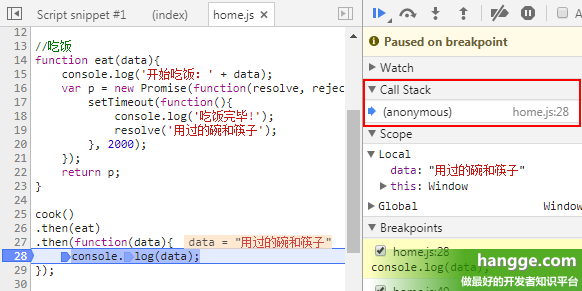

 

 

（2）开启 **Async** 模式后，异步函数之前的调用栈都会被记录下来，而且调用栈中代码执行状态也得到了保留。

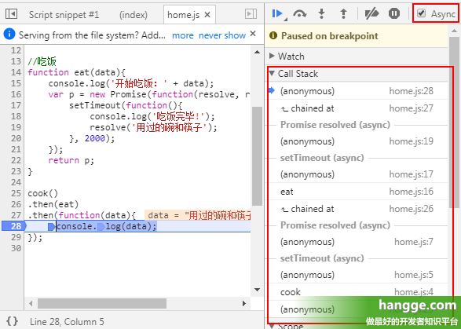

 

## 十、查找函数

有些函数查不到，在临时vm文件中，需要console调用打断点进入查看

## url断点

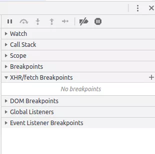

看到这个 XHR/fetch BreakPoints 没，在这里我们可以添加 url ，根据请求这个 url 打断点。而我们要打的断点就是一开始获取到的请求 url ： 

http://fanyi.youdao.com/translate_o?smartresult=dict&smartresult=rule

点击 XHR/fetch BreakPoints 右边的 + 号，然后把链接复制进去：

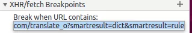

# whether Chrome console is open

https://stackoverflow.com/questions/7798748/find-out-whether-chrome-console-is-open

[Avoid the detection of “whether Chrome DevTools(console) is open”](https://stackoverflow.com/questions/38910904/avoid-the-detection-of-whether-chrome-devtoolsconsole-is-open)

# 参考文献

1. [Chrome 开发工具指南](http://wiki.jikexueyuan.com/project/chrome-devtools)