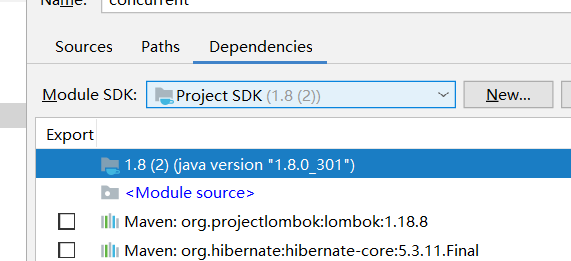
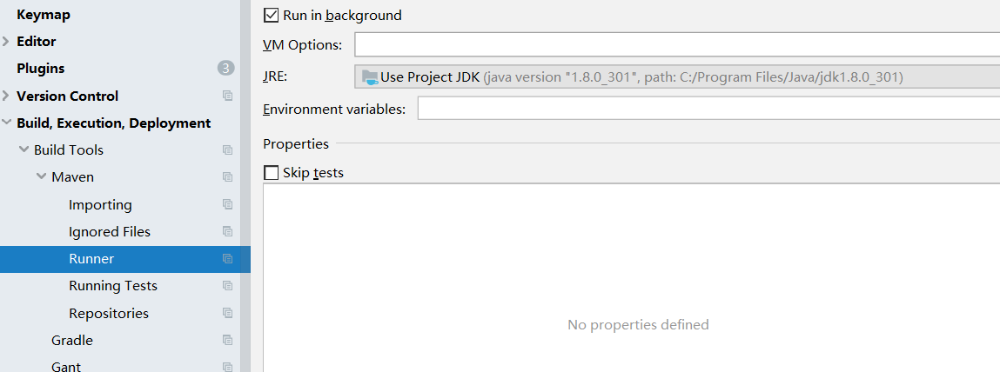
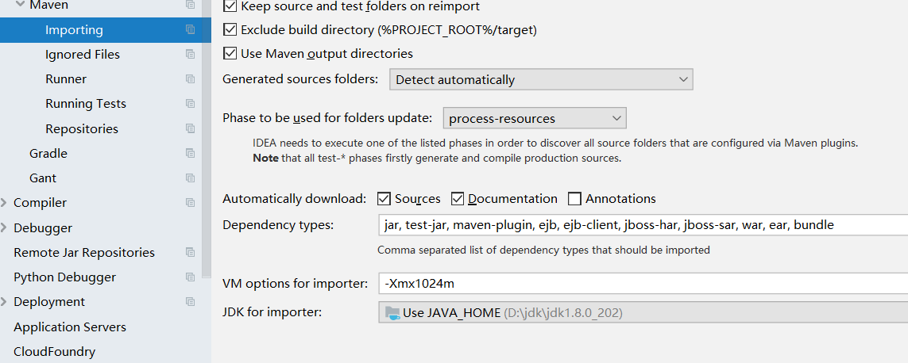

# 介绍

maven有pom文件定义，生命周期包括不同phase，每到一个phase都会有对应插件工作，插件工作的方式是执行自己的goal，每个插件都有自己的goal。可以直击执行生命周期，也可以单独执行goal。

idea的build和maven的build不一样，idea的build是一个文件一个文件的build，可能有不一样的异常信息，maven简单点。

maven是java命令，因此可以直接java启动命令，使用mvn则需要配合java_home.插件也是使用j'd'k的当前环境。。。什么时候使用jdk版本，运行插件的时候使用的jdk是运行maven的版本，但是为什么compiler可以编译不同版本甚至高版本的target。应该是compiler插件的能力。

jar也是有格式错误的。

[官网](https://maven.apache.org/settings.html)

http://www.mybatis.cn/archives/2327.html

https://www.jianshu.com/p/a5a5466097e1

https://www.jianshu.com/p/83c729e295f1

https://www.cnblogs.com/chcha1/p/11654344.html

https://blog.csdn.net/jeikerxiao/article/details/60324713 | Maven：mirror和repository区别_maven mirror rep-CSDN博客
https://www.jianshu.com/p/274c363ffd7c | maven的setting配置文件中mirror和repository的区别 - 简书
https://blog.csdn.net/www1056481167/article/details/60139851 | maven仓库中心mirrors配置多个下载中心(执行最快的镜像)_maven settings.xml 中多个 mirror 是怎么选择下载依赖的-CSDN博客
https://www.cnblogs.com/zhangs1986/p/17094040.html#:~:text=Maven%E7%9A%84Setting%E9%85%8D%E7%BD%AE%E4%B8%AD,%E5%AF%B9repository%E7%9A%84%E5%AE%8C%E5%85%A8%E4%BB%A3%E6%9B%BF%E3%80%82 | 多个仓库源配置及repositories和mirrors的配置 - 欢醉 - 博客园
https://blog.csdn.net/taugast/article/details/113787531 | 一文弄懂 maven 仓库, 仓库优先级, settings pom配置关系及差异_pom properties优先级-CSDN博客
https://www.cnblogs.com/zhaodalei/p/17594132.html | Maven配置中pom.xml和setting.xml之间的关系 - 浪迹天涯的派大星 - 博客园
https://blog.csdn.net/java_collect/article/details/83870215 | maven（三）最详细的profile的使用_maven profile-CSDN博客


插件https://www.jianshu.com/p/7500b1cfc69b

maven  enforcer

build-helper-maven

exec-maven


# 实践

1. 不继承parent里面的部分依赖

   子类重写，定义scope为test，打包则不会出现，亲测可用

   ```xml
           <dependencies>
   
               <dependency>
                   <groupId>xxx.yyy.zzz</groupId>
                   <artifactId>abcd</artifactId>
                   <scope>test</scope> <!-- 特殊处理，不引入父类lib -->
               </dependency>
   
           </dependencies>
   ```

   

## [Failed to read artifact descriptor](https://stackoverflow.com/questions/6642146/maven-failed-to-read-artifact-descriptor)

删除jar文件夹，然后重新下载

You can always try `mvn -U clean install`

`-U` forces a check for updated releases and snapshots on remote repositories.

2. 

[Missing artifact org.springframework.boot:spring-boot-starter-parent:jar:1.3.2.RELEASE](https://stackoverflow.com/questions/35745971/missing-artifact-org-springframework-bootspring-boot-starter-parentjar1-3-2-r)

You're getting this error because there is no jar artifact for spring-boot-starter-parent in maven central, since spring-boot-starter-parent uses pom packaging. The reason for that is because it's intended to be used as a parent pom:

```xml
<parent>
    <groupId>org.springframework.boot</groupId>
    <artifactId>spring-boot-starter-parent</artifactId>
    <version>1.3.2.RELEASE</version>
</parent>
```

Alternatively, you can just import the managed dependencies if that is what you intended to do:

```xml
<dependencyManagement>
    <dependencies>
        <dependency>
            <groupId>org.springframework.boot</groupId>
            <artifactId>spring-boot-starter-parent</artifactId>
            <version>1.3.2.RELEASE</version>
            <scope>import</scope>
            <type>pom</type>
        </dependency>   
    </dependencies>
</dependencyManagement>
```

You can read more about importing dependencies in the [Importing Dependencies section of the Introduction to the Dependency Mechanism](https://maven.apache.org/guides/introduction/introduction-to-dependency-mechanism.html#Importing_Dependencies) article.

# maven中jar包依赖的传递性的原理

### 说明：

在Maven中 如果A-----依赖-----B，B-----依赖-----C
当在pom.xml文件中添加A jar包时 B/C都会自动的添加依赖
将这种现象称之为叫做maven jar依赖的传递性.

### 1)--jar包传递性的案例:


### 2)--如何实现的?

项目通过依赖项进行jar包文件加载时,根据maven规则,会去本地库中查找该jar包文件.之后解析该jar包文件的 .pom.文件 如果该文件中有依赖项,则重复执行上述的过程.直到依赖完成为止结束.


# 如何保证jar包文件安全性???

### SHA1算法说明：

SHA-1（英语：Secure Hash Algorithm 1，中文名：安全散列算法1）是一种密码散列函数，美国国家安全局设计，并由美国国家标准技术研究所（NIST）发布为联邦数据处理标准（FIPS）

SHA-1可以生成一个被称为消息摘要的160位（20字节）散列值，散列值通常的呈现形式为40个十六进制数

```
一个字节8个bit(0|1)
```

### 消息摘要说明:

```
40位16进制数重复的概率是多少?? (2的4次方)40=2^160
```


# idea报红

[彻底解决idea maven依赖报红报错问题](https://blog.csdn.net/qq_37267706/article/details/106027647)

重启

清空pom再来。

清楚所有缓存在重启

新建一个空的项目，转移文件过去

换一下sdk可能就好

# 需要证书，选择导入了证书的jdk





# scope

[maven的scope值runtime是干嘛用的?](https://www.zhihu.com/question/338722003)

[【方向盘】升级到IDEA 2022.1版本后，我把Maven Helper卸载了](https://mp.weixin.qq.com/s?__biz=MzI0MTUwOTgyOQ==&mid=2247497564&idx=1&sn=e237578a7d75d25a3480a074f25d5712&chksm=e908c3f6de7f4ae09a5617d732a05ac361fb6f4fc6477f8c4ce16ad47abcae9b99ee1a97b2c7&scene=178&cur_album_id=1374601107946962947#rd)

> #### 依赖的Scope，provided和optional的区别，依赖传递机制，依赖仲裁
>
> runtime不生效的，都不会参与打包，不参与打包就不会参与传递，因为**在打包阶段，使用的是运行classpath**。只有compile和runtime这两个scope能够传递依赖。
>
> 特殊：spring boot的Maven插件可以配置，控制是否打包provide，默认貌似是会包含provide和optional（结果是这样，原因还不能确定，有可能）。所以现在本包provided和optional compile都可以打包进去，对于本包类似compile，但是还是不能传递，所以如果最终包不是本包，最终包就没有这个依赖，那就不打进去。
>
> 本包是最终包，build生效，test生效，runtime生效，参与打包，
>
> 本包不是最终包，不传递，最终包 build不生效，test不生效，runtime不生效，不参与打包，但不一定报错，除非用到那个功能却没有引入依赖。因此可以用于中间jar包
>
> runtime只能反射，所以用于本包的解耦，并且还可以传递，和compile的区别就是不能编译用到，只能反射

> 肾虚仔的问题应该是版本依赖锁定了，然后依赖分析工具分析不出来依赖冲突，说明就是版本锁定
>
> 版本的锁定方式有2种，依赖传递和版本锁定，后者优先

# 【maven】配置多个仓库

https://blog.csdn.net/sayyy/article/details/80451531

Maven：mirror和repository 区别

https://blog.csdn.net/Diligent_ten/article/details/79624351

https://blog.csdn.net/caomiao2006/article/details/40401517


# 参考文献

[yourbatman](https://mp.weixin.qq.com/mp/appmsgalbum?__biz=MzI0MTUwOTgyOQ==&action=getalbum&album_id=1374601107946962947&scene=173&from_msgid=2247490748&from_itemidx=1&count=3&nolastread=1#wechat_redirect)

https://www.cnblogs.com/jingmoxukong/p/6050172.html#activeprofiles | maven全局配置文件settings.xml详解 - 静默虚空 - 博客园
https://www.cnblogs.com/linjiqin/p/10091113.html | Maven项目打包成可执行Jar文件 - Ruthless - 博客园

[全面详解Maven的配置文件pom.xml（含常用plugin）](https://open.alipay.com/portal/forum/post/142401036)


https://developer.aliyun.com/article/308515 | maven之SCM(Software Configuration Managemen)，maven-release-plugin,distributionManagement与pluginRepositories插件-阿里云开发者社区

# 问题

2021idea版本和maven3.9.6版本合在一起报错，编译不了，降低版本