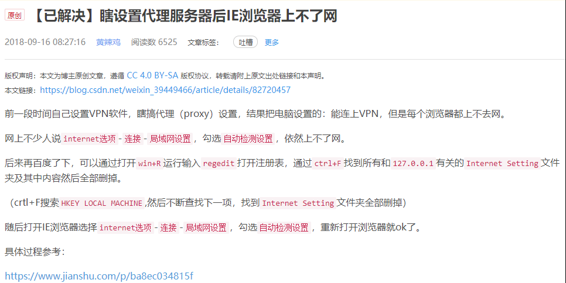
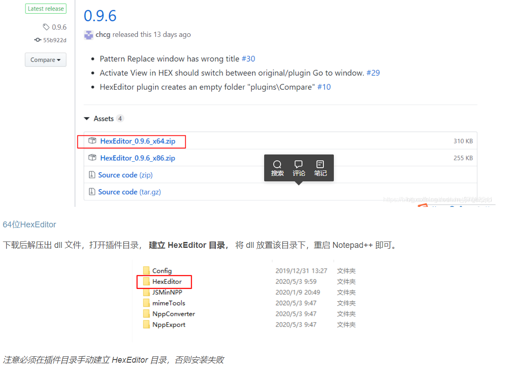

#  shadowsocks



https://www.zybuluo.com/gongzhen/note/472805

# navicat

常用快捷键
ctrl + q: 打开新查询窗口

ctrl + r: 运行当前窗口内的所有语句

ctrl + w: 关闭当前窗口

ctrl + d: 在表数据窗口上查看表定义

F6: 打开一个MySQL命令行窗口

非常用快捷键

ctrl + n: 打开新查询窗口

ctrl + shit + r: 只运行选中的语句

ctrl + /: 注释

ctrl + shift + /: 取消注释

ctrl + l: 删除一行

F7: 运行从光标当前位置开始的一条完整sql语句
————————————————
版权声明：本文为CSDN博主「shiyonghm」的原创文章，遵循 CC 4.0 BY-SA 版权协议，转载请附上原文出处链接及本声明。
原文链接：https://blog.csdn.net/shiyong1949/article/details/64445580

# fiddler

如果是需要使用fiddler capture https ，需要导入fiddler发布的证书并且信任（无法信任）

```java
Exception in thread "main" javax.net.ssl.SSLHandshakeException: sun.security.validator.ValidatorException: PKIX path building failed: sun.security.provider.certpath.SunCertPathBuilderException: unable to find valid certification path to requested target
    at com.sun.net.ssl.internal.ssl.Alerts.getSSLException(Unknown Source)
    at com.sun.net.ssl.internal.ssl.SSLSocketImpl.fatal(Unknown Source)
    at com.sun.net.ssl.internal.ssl.Handshaker.fatalSE(Unknown Source)
    at com.sun.net.ssl.internal.ssl.Handshaker.fatalSE(Unknown Source)
    at com.sun.net.ssl.internal.ssl.ClientHandshaker.serverCertificate(Unknown Source)
    at com.sun.net.ssl.internal.ssl.ClientHandshaker.processMessage(Unknown Source)
    at com.sun.net.ssl.internal.ssl.Handshaker.processLoop(Unknown Source)
    at com.sun.net.ssl.internal.ssl.Handshaker.process_record(Unknown Source)
    at com.sun.net.ssl.internal.ssl.SSLSocketImpl.readRecord(Unknown Source)
    at com.sun.net.ssl.internal.ssl.SSLSocketImpl.performInitialHandshake(Unknown ...
```

https://stackoverflow.com/questions/8549749/how-to-capture-https-with-fiddler-in-java

# notepad

[notepad++ 64位安装 HexEditor 二进制编辑插件](https://blog.csdn.net/shift_wwx/article/details/108320847)

https://github.com/chcg/NPP_HexEdit/releases



# vmware


[VMware虚拟机桥接网络保姆级设置教程](https://segmentfault.com/a/1190000039918994)

# Typora

[Typora/VSCode/Sublime 更改Markdown默认宽度样式等](https://www.cnblogs.com/ytyt2002ytyt/p/8356626.html)

**Typora** **所见即所得****Markdown****编辑器更改 最大宽度**

C:\Users\Desk\AppData\Roaming\Typora\themes\github.css

CSS第46行改为

  max-width: 1920px;

新增github。user。css来改